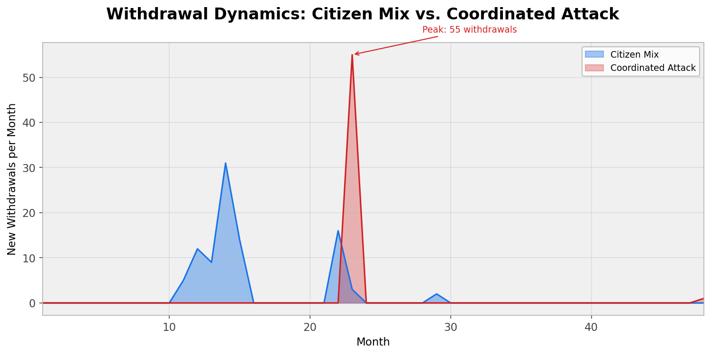

# Degressive Democracy

**Agent-based simulation of irreversible vote withdrawal as democratic accountability mechanism.**

> Citizens can withdraw their vote from an elected politician **once per legislative term, irreversibly**. This creates continuous accountability pressure. The simulation shows: promise-keeping is a Nash equilibrium, populists are always eliminated, and at municipal level the mere existence of the mechanism suffices as deterrence.

## Key Findings

1. **Promise-keeping is Nash equilibrium** — formally proven (Theorem 1) and robust across 4 satisfaction models including Prospect Theory
2. **Transparency matters more than the mechanism** — promise tracking (Wahl-O-Mat level) halves withdrawals and doubles satisfaction
3. **Populists are always eliminated** — in 100% of tested configurations (3/4 satisfaction models)
4. **Municipal level is optimal** — zero withdrawals needed, mechanism works as "dormant institution" (Serdult 2015)
5. **Information asymmetry is the real challenge** — Strategic Minimum politicians exploit low visibility to break invisible promises unpunished (Corollary 4)

## Formal Result

**Theorem 1**: Promise-keeping is a Nash equilibrium iff:

```
b_p × w × V_br × T / 2 > b_br × n
```

where `b_p` = power benefit, `w` = withdrawal rate per visible broken promise, `V_br` = sum of visibilities of broken promises, `T` = term length, `b_br` = benefit per broken promise, `n` = number broken.

**Corollary 4** (Information Asymmetry Paradox): Strategic Minimum undermines Nash by minimizing `V_br` — breaking only invisible promises. The formal condition holds but the effective withdrawal rate approaches zero.

## Simulation Design

- **6 citizen types** with Prospect Theory satisfaction model (Kahneman & Tversky 1979)
- **5 politician strategies**: Keeper, Strategic Minimum, Frontloader, Populist, Adaptive
- **4 power models** at different government levels
- **18 scenarios** including German-specific parameters
- **126 tests**, deterministic and reproducible

## Germany Scenarios

7 scenarios with German parameters (23.4% non-voters, Wahlprogramm visibility):

| Scenario | Withdrawals | Satisfaction |
|---|---|---|
| Status quo (vis 0.61) | 118 +/- 23 | 0.69 |
| Wahl-O-Mat tracking (vis 0.83) | 91 | 0.80 |
| Full transparency (vis 0.98) | 76 +/- 5 | 0.80 |
| Investigative journalism | 165 | 0.61 |
| Economic crisis (blame shift) | 79 | 0.80 |

## Interactive Dashboard

Open [output/dashboard.html](output/dashboard.html) in a browser — DE/EN toggle, animated simulation, 5 scenarios.

## Simulation Outputs





## References

- Ferejohn, J. (1986). Incumbent Performance and Electoral Control. *Public Choice* 50.
- Kahneman, D. & Tversky, A. (1979). Prospect Theory. *Econometrica* 47(2).
- Serdult, U. (2015). The history of a dormant institution. *Representation* 51(2).
- Welp, Y. (2016). Recall referendums in Peruvian municipalities. *Democratization* 23(7).
- Laver, M. & Sergenti, E. (2011). *Party Competition*. Princeton UP.
- Epstein, J.M. & Axtell, R.L. (1996). *Growing Artificial Societies*. MIT Press.

## Citation

```bibtex
@techreport{munz2026dd,
  title  = {Degressive Democracy: Agent-Based Simulation of
            Irreversible Vote Withdrawal},
  author = {Munz, Michael},
  year   = {2026}
}
```

## A Note on Process and Transparency

This project was developed with AI coding assistance. Architecture, research questions, and interpretation of results are human contributions. See the [repository-level transparency note](../README.md#transparency) for details.

## License

PolyForm Noncommercial 1.0 — see [LICENSE](LICENSE)

## Author

Michael Munz
