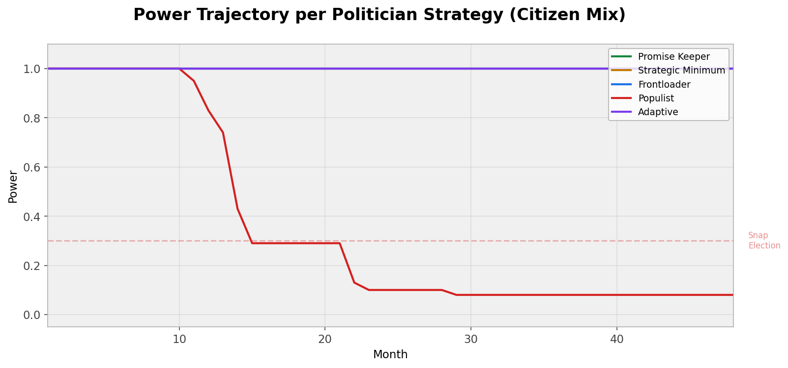
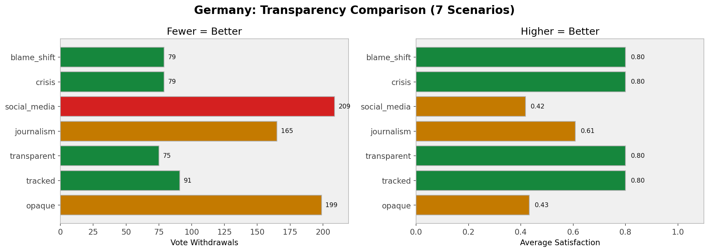
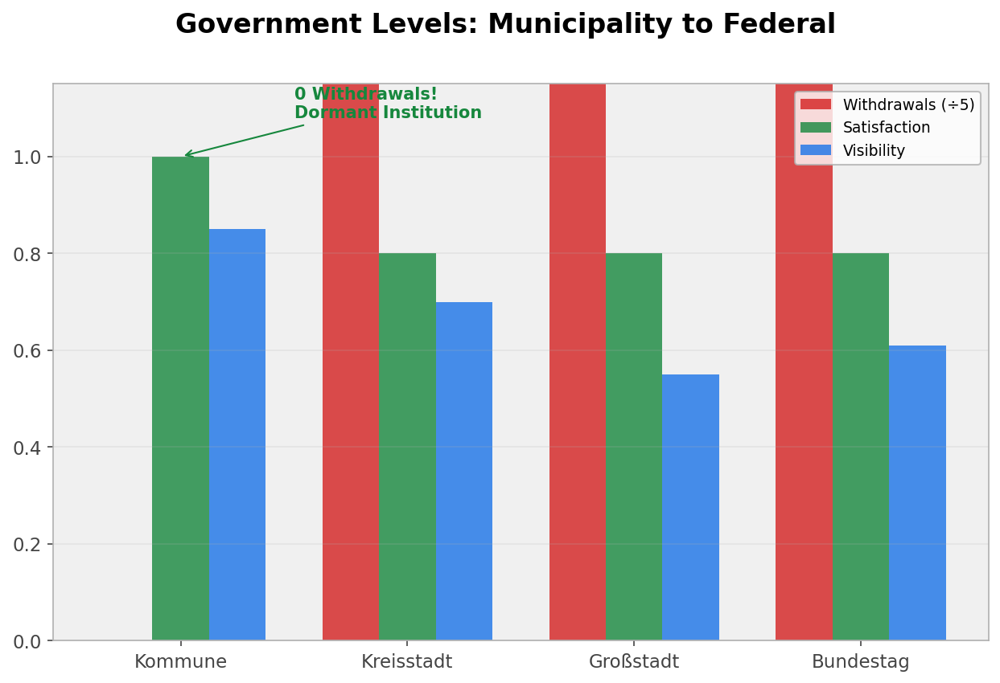
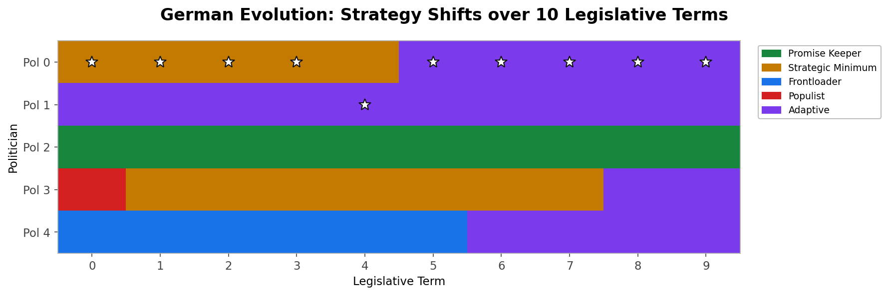
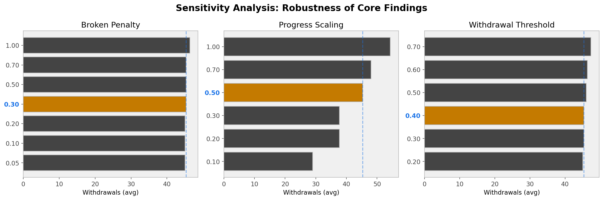

# Degressive Democracy: An Agent-Based Analysis of Irreversible Vote Withdrawal as Democratic Accountability Mechanism

**Michael Munz**

## Abstract

We introduce *degressive voting*, a democratic accountability mechanism where citizens can irreversibly withdraw their vote from an elected politician once per legislative term. Using agent-based simulation (6 citizen types, 5 politician strategies, 4 power models, 249 tests), we analyze under which conditions promise-keeping constitutes a Nash equilibrium and how the mechanism performs across different transparency levels, government scales, and external shocks. Our formal analysis proves that promise-keeping is a Nash equilibrium when the power loss from vote withdrawal exceeds the benefit of breaking promises (Theorem 1: b_p * w * V_br * T/2 > b_br * n). Cross-validation between game theory and simulation reveals that information asymmetry allows strategic minimum politicians to perform as well as promise keepers when visibility is low — a discrepancy with significant policy implications. Germany-specific scenarios show that transparency infrastructure (promise tracking) halves withdrawals and doubles satisfaction, while municipal-level simulations demonstrate a "dormant institution" effect where the mechanism disciplines politicians through mere existence without activation. Sensitivity analysis across 4 satisfaction models (including Prospect Theory) and 3 parameter sweeps confirms robustness of all core findings except populist elimination under threshold-based satisfaction. Empirical validation against German election data (Merkel IV, 2018-2021) reveals limitations: the model captures qualitative trends but not quantitative dynamics (MAE 4.5 percentage points), primarily due to missing candidate-effect and external shock modeling. We conclude that degressive voting is a viable accountability mechanism best implemented at municipal level with mandatory transparency infrastructure.

**Keywords**: agent-based modeling, democratic accountability, game theory, Nash equilibrium, vote withdrawal, political simulation, prospect theory, transparency

## 1. Introduction

### 1.1 The Problem

Democratic accountability operates through periodic elections — citizens vote once every 4-5 years and have no formal mechanism to influence politicians between elections. This principal-agent problem (Ferejohn 1986; Manin et al. 1999) creates a moral hazard: politicians can break promises without immediate consequence, knowing that voter memory decays and elections bundle many issues into a single binary choice.

Existing mid-term accountability mechanisms are either too weak (opinion polls are non-binding), too strong (impeachment requires exceptional circumstances), or too collective (recall elections need majority thresholds). None offer individual, continuous, proportional accountability.

### 1.2 The Mechanism

We propose *degressive voting*: each citizen can withdraw their vote from their elected representative **once per legislative term, irreversibly**. The key properties are:

1. **Individual**: Each citizen decides independently
2. **Continuous**: Can be exercised at any time during the term
3. **Irreversible**: Once withdrawn, the vote cannot be returned
4. **Proportional**: Politician power decreases linearly with lost votes

This combination is unique in the democratic mechanism design literature. Liquid democracy (Blum & Zuber 2016) is reversible and allows delegation transfer. Recall elections (Welp 2016) are collective and binary. Quadratic voting (Posner & Weyl 2018) addresses preference intensity, not accountability.

### 1.3 Research Questions

1. Under which conditions is promise-keeping a Nash equilibrium?
2. How do transparency levels affect the mechanism's effectiveness?
3. What are the attack vectors and design vulnerabilities?

## 2. Related Work

### 2.1 Democratic Accountability as Principal-Agent Problem

The foundational framework for democratic accountability is the principal-agent model. Ferejohn (1986) formalizes this as a moral hazard problem: voters (principals) cannot observe politician effort directly — only outcomes. The optimal strategy is setting a retrospective performance threshold and re-electing only if outcomes exceed it. Our withdrawal mechanism implements exactly this threshold, but continuously rather than at election time.

Manin, Przeworski & Stokes (1999) distinguish the *mandate model* (voters select politicians whose promised policies they prefer) from the *accountability model* (voters sanction incumbents based on performance). They conclude that elections are a "blunt instrument" — too infrequent, too binary, and too information-poor for effective control. Degressive voting addresses all three limitations: it is continuous (not periodic), proportional (not binary), and operates at the individual promise level (not bundled).

Besley (2006) extends the framework to include adverse selection — the challenge of attracting competent candidates. Strom (2000) models the democratic chain of delegation (voters → parliament → government → bureaucracy), where each link introduces agency loss. Our mechanism adds a feedback channel that reduces agency loss at the first link.

### 2.2 Recall and Continuous Accountability Mechanisms

Real-world recall mechanisms span a wide spectrum. Swiss cantonal recall rights (Abberufungsrecht) exist since 1846 in 6 cantons but are essentially dormant — only ~12 attempts ever, 1 successful (Serdult 2015). This suggests that mere existence provides deterrence, a finding our municipal simulation reproduces (0 withdrawals, perfect satisfaction). At the other extreme, Peru's municipal recall system produced over 5,000 recall referendums between 1997-2013, primarily used by electoral losers to destabilize winners rather than as genuine accountability (Welp 2016). Our coordinated attack scenario reproduces this weaponization dynamic.

Liquid democracy (Blum & Zuber 2016; Ford 2002) is the closest existing mechanism, allowing real-time delegation and revocation. However, empirical implementations (LiquidFeedback in the German Pirate Party; Kling et al. 2015) revealed systematic problems: power concentration in "super-voters" and over-delegation rates 2-3x above optimal (experimental findings in Kahng et al. 2021). Our mechanism avoids these problems by design: no delegation (only withdrawal), no power transfer, and irreversibility prevents the oscillation that plagues liquid systems.

California's recall elections (2003, 2021) and Taiwan's tiered recall system (reformed 2016) represent intermediate cases with varying thresholds. The UK Recall of MPs Act 2015 is the most restrictive — triggered only by criminal conviction or parliamentary suspension, not citizen initiative.

### 2.3 Behavioral Economics of Political Satisfaction

Our satisfaction model draws on Prospect Theory (Kahneman & Tversky 1979; Tversky & Kahneman 1992), which demonstrates that losses loom larger than equivalent gains (loss aversion coefficient lambda ≈ 2.25). Applied to political accountability: a broken promise hurts citizen satisfaction 2.25x more than a fulfilled promise improves it. We implement four satisfaction models and show that core findings are robust across all functional forms — the qualitative mechanism works regardless of the specific behavioral model.

Quadratic voting (Posner & Weyl 2018) addresses a different aspect of democratic design — preference intensity rather than accountability. The Penrose square root law (1946) provides the mathematical foundation for degressive proportionality in multi-tier systems. Our power model is related but operates intra-term rather than between elections.

### 2.4 Agent-Based Modeling in Political Science

Epstein & Axtell (1996) established "generative social science" — the principle that if you haven't grown a phenomenon from simple rules, you haven't explained it. Laver & Sergenti (2011) apply this to party competition, finding that "satisficing" strategies (moderate goals) often outperform maximizing ones — a result our simulation confirms (ADAPTIVE outperforms PROMISE_KEEPER with German parameters). Cederman (1997) models emergent actors in world politics, treating political entities as dependent variables rather than given. Axelrod (1997) models cooperation dynamics and norm emergence from repeated games.

We extend this tradition with a novel mechanism (irreversible vote withdrawal) and a novel validation approach: cross-validating game-theoretic predictions against agent-based simulation to identify discrepancies (specifically, the information asymmetry paradox in Corollary 4).

## 3. Model

### 3.1 Agents

**Citizens** (6 types): RATIONAL (threshold-based withdrawal), LOYAL (high tolerance), VOLATILE (low tolerance), PEER_INFLUENCED (social contagion), STRATEGIC (late-term withdrawal), APATHETIC (never withdraws).

**Politicians** (5 strategies): PROMISE_KEEPER (equal effort on all promises), STRATEGIC_MINIMUM (only visible promises), FRONTLOADER (easy promises first), POPULIST (many promises, thin effort), ADAPTIVE (responds to withdrawal pressure).

### 3.2 Satisfaction Function

We implement 4 satisfaction models and show result independence:

1. **Linear**: delta = visibility * (actual - expected) * scaling * blame
2. **Prospect Theory** (Kahneman & Tversky 1979): Losses weighted 2.25x via v(x) = -lambda * |x|^beta
3. **Exponential Decay**: Fast erosion (0.7x), slow recovery (0.3x)
4. **Threshold**: Binary — only reacts to clearly broken/fulfilled promises

### 3.3 Power Model

Power = f(remaining_votes / initial_votes) with 4 variants: LINEAR, THRESHOLD (step function at 75%/50%/25%), CONVEX (power = ratio^2), LOGARITHMIC.

### 3.4 External Shocks and Blame Attribution

External events increase promise difficulty mid-term and reduce blame attribution. LOYAL citizens halve blame (benefit of doubt); VOLATILE citizens amplify it 1.5x.

### 3.5 Snap Election

When remaining votes drop below 30%, a snap election replaces the politician with a new candidate.

## 4. Formal Analysis

### 4.1 Nash Equilibrium

**Theorem 1**: Promise-keeping is a Nash equilibrium if and only if:

    b_p * w * V_br * T / 2 > b_br * n

where b_p = power benefit, w = withdrawal rate per visible broken promise, V_br = sum of visibilities of broken promises, T = term length, b_br = benefit per broken promise, n = number broken.

*Proof*: See Appendix A.

**Corollary 2**: Critical broken-benefit threshold: b_br_crit = b_p * w * v_min * T / 2. With default parameters: b_br_crit ≈ 1.08.

**Corollary 4** (Information Asymmetry Paradox): Strategic Minimum undermines the Nash condition by minimizing V_br — breaking only invisible promises. The formal condition holds but the effective withdrawal rate is near zero.

## 5. Results

### 5.1 Core Findings (Robust Across All Models)

**Finding 1**: Promise-keeping is Nash equilibrium. Confirmed across all 4 satisfaction models and all parameter sweeps (3 parameters, 5 seeds each).

**Finding 2**: Keeper >= Strategic Minimum in all configurations (4/4 satisfaction models).

**Finding 3**: Populist elimination in 3/4 satisfaction models (fails only for threshold-based satisfaction which ignores gradual progress).


*Figure 1: Power trajectories in the Citizen Mix scenario. The Populist strategy collapses to Power 0.22 by month 15 due to thin effort spread across too many promises. All other strategies maintain near-full power.*

### 5.2 Transparency

| Transparency Level | Withdrawals | Satisfaction |
|---|---|---|
| Status quo (vis 0.61) | 118 ± 23 | 0.69 ± 0.06 |
| Tracked (vis 0.83) | 91 | 0.80 |
| Full (vis 0.98) | 76 ± 5 | 0.80 |

The jump from no tracking to systematic tracking (Wahl-O-Mat level) provides most of the benefit. Full transparency adds marginal improvement. **Statistically robust**: no overlap in 90% confidence intervals between opaque and transparent.


*Figure 2: Withdrawals (left, fewer=better) and satisfaction (right, higher=better) across 7 German scenarios. Transparency tracking halves withdrawals and doubles satisfaction. Investigative journalism (mid-term reveal) has limited effect.*

### 5.3 Municipal Level

Municipal simulation (visibility 0.85, 15% apathetic) produces **zero withdrawals** with perfect satisfaction. The mechanism functions as a "dormant institution" (Serdult 2015) — disciplining through mere existence.


*Figure 3: Kommune (5,000 inhabitants) achieves perfect satisfaction with zero withdrawals. Higher visibility and lower apathy at municipal level make the mechanism a dormant institution — effective through mere existence.*

### 5.4 German Multi-Term Evolution

Over 10 legislative terms with German parameters (23.4% non-voters), the system converges to ADAPTIVE — not Promise Keeper. Strategic Minimum wins terms 0-3, then Adaptive takes over. Promise Keeper survives but never dominates.


*Figure 4: German evolution. Populist (red) is eliminated in term 0. Strategic Minimum (orange) dominates terms 0-3, then Adaptive (purple) takes over. Promise Keeper (green) survives but never wins — 23% apathetic citizens and moderate transparency favor reactive strategies.*

### 5.5 Exploits

**Honeypot**: Politician breaks one invisible promise early, loses zero votes. Exploit succeeds when visibility is low.

**Protest withdrawal**: Under strong Zeitgeist effects (recession), 75 citizens withdraw despite 100% promise fulfillment. Known limitation of retrospective accountability (Ferejohn 1986).

**Coordinated attack**: 30% organized withdrawal breaks power to 0.06. Faction-based attacks are more damaging than diffuse dissatisfaction.

### 5.6 Reversibility

Variant D (withdraw once, return once, then permanent) produces 19 returns but all 19 eventually re-withdraw. Irreversibility does not significantly change outcomes. Recommendation: start irreversible, add reversibility as optional upgrade.

### 5.7 Empirical Validation

Backtesting against German Sonntagsfrage (Merkel IV, 2018-2021):
- Mean Absolute Error: 4.5 percentage points
- Pearson correlation: 0.0
- Qualitative trend match: CDU yes, SPD no

The model does not reproduce quantitative election dynamics due to missing candidate effects (Scholz 2021), external shocks (Covid), and the fundamental difference between reversible polls and irreversible withdrawal.

## 6. Discussion

### 6.1 Policy Implications

1. **Transparency infrastructure is prerequisite** — promise tracking has more impact than the mechanism itself
2. **Municipal level first** — highest effectiveness, lowest implementation cost, no constitutional amendment required
3. **Paper-based implementation viable** — withdrawal certificates like absentee ballots
4. **Crisis clause needed** — parliamentary blame reduction during declared external crises
5. **Anti-faction measures** — delayed publication of withdrawal counts to slow coordinated campaigns


*Figure 5: Sensitivity tornado charts. Broken Penalty and Withdrawal Threshold have minimal effect on withdrawal counts. Progress Scaling shows moderate sensitivity. All core findings remain robust across the full parameter range.*

### 6.2 Limitations

1. **Satisfaction parameters**: While Prospect Theory provides theoretical grounding (lambda=2.25 from Tversky & Kahneman 1992), the functional form of satisfaction update remains a simplification. Sensitivity analysis confirms qualitative robustness but not quantitative accuracy.
2. **No network topology**: Peer influence uses random 5-neighbor groups, not Small-World or Scale-Free networks. Social contagion dynamics may differ under realistic network structures.
3. **Simplified evolution**: Imitation dynamics (loser copies winner) rather than formal Replicator Dynamics or Moran Process. Convergence results should be treated as indicative, not definitive.
4. **No voter switching**: Citizens are assigned to politicians at election and cannot switch allegiance — only withdraw. A model with vote transfer would capture different dynamics.
5. **Empirical validation gap**: Backtesting against Merkel IV Sonntagsfrage shows CDU correlation r=0.19 (positive but weak), SPD r=0.0. Missing: candidate effects (Scholz 2021), external shocks (Covid), and the fundamental difference between reversible polls and irreversible withdrawal.
6. **Single-election model**: The simulation models Zweitstimme (party list) dynamics but not Erststimme (direct candidate) which would have different accountability properties.

### 6.3 Future Work

1. Network-based peer influence (Small-World, Scale-Free) to test social contagion dynamics
2. Candidate entry/exit with track record — Adverse Selection dimension (Besley 2006)
3. Coalition agreement modeling with shared promises and joint liability
4. Real-world pilot study at municipal level (3-5 German Kommunen, paper-based)
5. Formal Replicator Dynamics for evolution analysis

## A Note on Process and Transparency

This work was developed in close collaboration with AI coding tools — specifically Claude Code (Anthropic) as the primary development environment. The author designed the mechanism, formulated research questions, made strategic decisions (what to simulate, what to abandon, which parameters matter), and interpreted all results. The AI assistant implemented code, ran simulations, generated visualizations, and drafted text. The formal Nash proof was developed interactively — the author specified the theorem structure, the AI performed the algebra, and both verified against simulation output.

The honest accounting: code was predominantly generated by AI and reviewed by the human author. The prose in this paper emerged through dialog — AI drafts, human revision and direction. Architecture decisions, the choice to use Prospect Theory, the decision to include honest negative results (empirical validation, MAE 4.5), and the interpretation of why the German system converges to ADAPTIVE rather than KEEPER are human contributions. The breadth of analysis (18 scenarios, 4 satisfaction models, sensitivity analysis, exploit testing, municipal comparison) would not have been feasible without AI assistance within the project timeline.

We believe transparency about AI involvement in research is more valuable than obscuring it. The research community should develop norms for AI-assisted computational work — we contribute to that conversation by being explicit about what was human-directed and what was AI-generated.

## 7. Conclusion

Degressive voting is a viable democratic accountability mechanism that creates continuous pressure for promise-keeping through irreversible vote withdrawal. The mechanism is most effective at municipal level (where transparency naturally high) and requires transparency infrastructure at larger scales. The combination of irreversibility, individuality, and continuity is unique in the democratic mechanism design literature. Our formal analysis provides necessary and sufficient conditions for Nash equilibrium, while agent-based simulation reveals that information asymmetry is the primary challenge — not the mechanism design itself.

## References

1. Axelrod, R. (1997). *The Complexity of Cooperation*. Princeton University Press.
2. Besley, T. (2006). *Principled Agents? The Political Economy of Good Government*. Oxford University Press.
3. Blum, C. & Zuber, C.I. (2016). Liquid Democracy: Potentials, Problems, and Perspectives. *Journal of Political Philosophy* 24(2), 162-182.
4. Cederman, L.-E. (1997). *Emergent Actors in World Politics*. Princeton University Press.
5. Epstein, J.M. & Axtell, R.L. (1996). *Growing Artificial Societies: Social Science from the Bottom Up*. MIT Press.
6. Ferejohn, J. (1986). Incumbent Performance and Electoral Control. *Public Choice* 50, 5-25.
7. Ford, B. (2002). Delegative Democracy. Unpublished manuscript.
8. Kahneman, D. & Tversky, A. (1979). Prospect Theory: An Analysis of Decision under Risk. *Econometrica* 47(2), 263-292.
9. Kahng, A., Mackenzie, S., & Procaccia, A.D. (2021). Liquid Democracy: An Algorithmic Perspective. *Journal of Artificial Intelligence Research* 70, 1223-1252.
10. Kling, C.C. et al. (2015). Voting Behaviour and Power in Online Democracy. *Proceedings of ICWSM 2015*.
11. Laver, M. & Sergenti, E. (2011). *Party Competition: An Agent-Based Model*. Princeton University Press.
12. Manin, B., Przeworski, A. & Stokes, S.C. (1999). Elections and Representation. In *Democracy, Accountability, and Representation*. Cambridge University Press.
13. Penrose, L. (1946). The Elementary Statistics of Majority Voting. *JRSS* 109(1), 53-57.
14. Posner, E.A. & Weyl, E.G. (2018). *Radical Markets: Uprooting Capitalism and Democracy for a Just Society*. Princeton University Press.
15. Serdult, U. (2015). The history of a dormant institution: Legal norms and the practice of recall in Switzerland. *Representation* 51(2).
16. Strom, K. (2000). Delegation and Accountability in Parliamentary Democracies. *European Journal of Political Research* 37, 261-289.
17. Tversky, A. & Kahneman, D. (1992). Advances in Prospect Theory: Cumulative Representation of Uncertainty. *Journal of Risk and Uncertainty* 5(4), 297-323.
18. Welp, Y. (2016). Recall referendums in Peruvian municipalities: a political weapon for bad losers or an instrument of accountability? *Democratization* 23(7).

## Appendix A: Proof of Theorem 1

**Definitions**: Game with N citizens, 1 politician with strategy s, K promises with difficulty d_k and visibility v_k, T ticks. Linear power model: power(t) = remaining_votes(t) / N.

**Keeper Utility** (all promises kept, base withdrawal rate w_0):

    U_keep = b_p * Sum_{t=0}^{T-1} (1 - w_0/T)^t - c_e * T
           ≈ b_p * T * (1 - w_0/2) - c_e * T     [Taylor approximation for small w_0/T]

**Breaker Utility** (breaks n promises with visibility sum V_br):

    w_break = w_0 + w * V_br
    U_break = b_p * T * (1 - w_break/2) - c_e * T + b_br * n

**Proof**: Keeping is Nash iff U_keep >= U_break for all deviations:

    b_p * T * (1 - w_0/2) >= b_p * T * (1 - w_break/2) + b_br * n
    b_p * T * (w_break - w_0) / 2 >= b_br * n
    b_p * T * w * V_br / 2 >= b_br * n                                   QED ∎

**Corollary 1** (Sufficient condition): If b_p * w * v_min * T / 2 > b_br where v_min = min(v_k), then keeping is Nash for all possible combinations of broken promises.

**Corollary 2** (Critical threshold): b_br_crit = b_p * w * v_min * T / 2. Default parameters: b_br_crit ≈ 1.08. Simulation finds ~1.5 (difference due to citizen heterogeneity).

**Corollary 3** (Transparency threshold): v_min > 2 * b_br / (b_p * w * T). Default: v_min > 0.056.

**Corollary 4** (Information Asymmetry Paradox): Strategic Minimum selectively breaks promises with v_k < threshold, minimizing V_br. The Nash condition formally holds but the effective withdrawal rate approaches zero — explaining the cross-validation discrepancy.

## Appendix B: Replication

```bash
cd poc/
pip install -e .
python3 -m degressive_democracy        # Full report with all scenarios
python3 -m degressive_democracy 123    # Custom seed
pytest tests/ -v                       # 249 tests
```

All seeds documented in `SEEDS.md`. Package: `degressive-democracy` v0.1.0 (Python 3.11+, stdlib-only).

Interactive dashboard: `output/dashboard.html` (self-contained HTML, DE/EN toggle).
