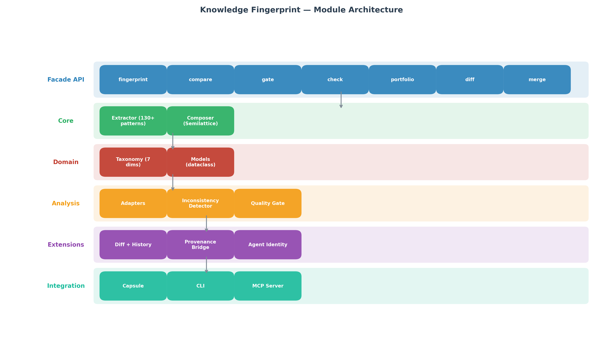
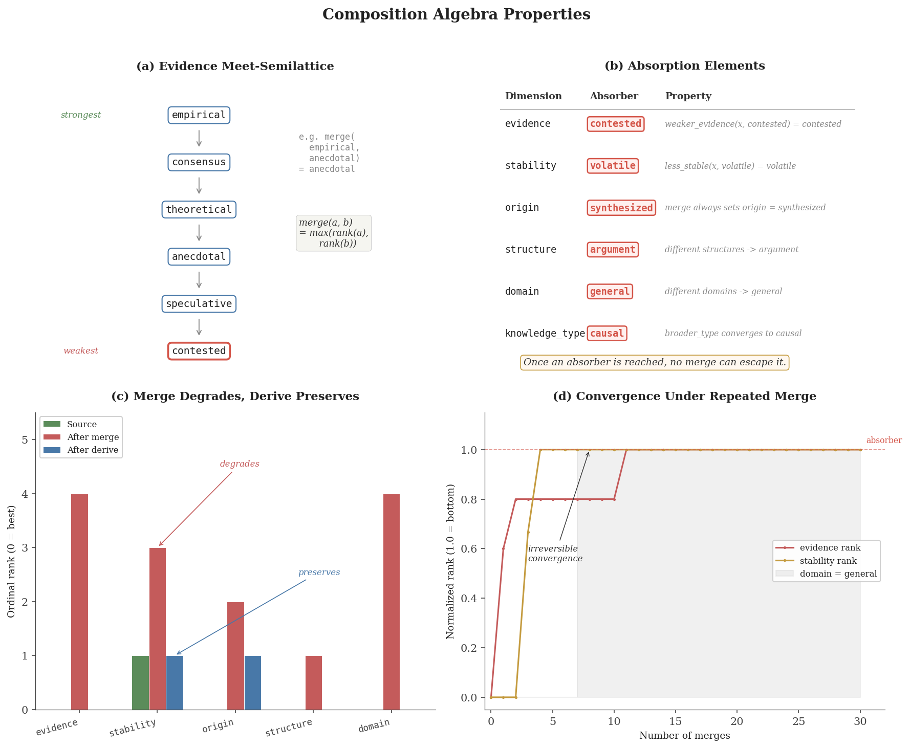

# Knowledge Fingerprint (KFP)

**Epistemological identity for knowledge and AI agents.**

A 7-dimensional taxonomy with a formally proven composition algebra
(Meet-Semilattice), deterministic metadata inconsistency detection,
continuous risk scoring, agent behavioral profiling, team blind-spot
analysis, and portable Knowledge Units.

Standard-library Python. 914 tests passing. `pip install kfp-fingerprint`. PolyForm Noncommercial 1.0.

 | [Research paper (PDF)](paper/knowledge_fingerprint_paper.pdf) | [DOI: 10.5281/zenodo.19519682](https://doi.org/10.5281/zenodo.19519682)

> **Looking for collaborators.** This is a single-author research artifact.
> We need help with **(1) integration into production RAG systems**,
> **(2) cross-domain validation** (legal, finance, engineering), and
> **(3) multi-agent framework adapters** (LangGraph, CrewAI, AutoGen).
> See [Call for collaborators](#call-for-collaborators).



## Core idea

Every piece of knowledge has an epistemological identity — a combination
of what kind of knowledge it is, how well supported, how stable, where it
came from, and how it was created. KFP encodes this identity as a compact,
human-readable, cryptographically verifiable fingerprint:

```
v2:causal:empirical:slow_decay:primary:claim:medical:innate@a7f3b2c9e1d4
│   │      │         │          │       │     │       │      │
│   │      │         │          │       │     │       │      └─ SHA-256[:12]
│   │      │         │          │       │     │       └─ Genesis (4 types)
│   │      │         │          │       │     └─ Domain (5 values)
│   │      │         │          │       └─ Structure (5 values)
│   │      │         │          └─ Origin (4 values)
│   │      │         └─ Stability (4 values, ordinal)
│   │      └─ Evidence (6 values, ordinal)
│   └─ Knowledge Type (7 values)
└─ Format version
```

**67,200 possible semantic combinations.** Each fingerprint is deterministically
extractable from text without requiring an LLM. Optional LLM enhancement
available for higher accuracy.

## What KFP does that nothing else does

| Capability | KFP | LangSmith | DeepEval | RAGAS | AgentOps |
|---|:---:|:---:|:---:|:---:|:---:|
| **Epistemological identity** | **YES** | -- | -- | -- | -- |
| **Algebraic composition** | **YES** | -- | -- | -- | -- |
| **Continuous risk scoring** | **YES** | -- | -- | -- | -- |
| **Role consistency check** | **YES** | -- | -- | -- | -- |
| **Team blind-spot detection** | **YES** | -- | -- | -- | -- |
| **Drift trajectory analysis** | **YES** | metric only | metric only | -- | metric only |
| **Deterministic (no LLM needed)** | **YES** | no | no | no | yes (ops only) |
| Production observability | -- | **YES** | -- | -- | **YES** |
| Output quality metrics | -- | **YES** | **YES** | **YES** | -- |

KFP answers **"what kind of knowledge is this?"** — the others answer
**"how good is it?"** They are complementary, not competing.

See the research paper for full comparison.

## Quickstart

```bash
pip install kfp-fingerprint
```

### Safety filter for RAG (primary use case)

```python
from kfp.quality_gate import safe_retrieve

# Drop-in addition to any retriever pipeline
docs = retriever.invoke("aspirin dosage")
safe_docs = safe_retrieve(docs, domain="medical", max_risk=0.3)
# → Speculative/anecdotal content filtered out
# → Each doc scored on a 0.0-1.0 risk scale
```

### Extract a fingerprint

```python
from kfp import fingerprint

fp = fingerprint("Aspirin inhibits COX-1 and COX-2 enzymes.", domain="medical")
print(fp)
# → v2:causal:consensus:slow_decay:primary:claim:medical:innate@18d2...
print(fp.explain())
# → "Causal knowledge with consensus evidence, slow decay..."
```

### Quality gate with risk score

```python
from kfp import gate

result = gate(fp)
print(result.risk_score)    # 0.08 (safe)
print(result.risk_factors)  # []

fp_blog = fingerprint("I think aspirin might help.", domain="medical")
result2 = gate(fp_blog)
print(result2.risk_score)   # 0.80 (high risk)
print(result2.risk_factors) # ["weak evidence (speculative)", "high-stakes domain"]
```

### Merge safety check

```python
from kfp import merge_guard

warning = merge_guard(fp_study, fp_blog_post)
# → risk: "dangerous", reason: "Evidence gap 4 steps (empirical → speculative)"
```

### Agent identity with custom roles

```python
from kfp import AgentProfile, register_role

# Define custom role expectations (or use built-in: auditor, researcher, executor, ...)
register_role("my_analyst", {"causal", "correlative", "definitional"}, "empirical")

profile = AgentProfile(agent_id="agent_1", role="my_analyst")
profile.add_session(fingerprints=[fp1, fp2, fp3], behavior=behavior)

diagnosis = profile.diagnose()
# → {status: "warning", drift_score: 0.42, issues: [...]}
```

### CLI

```
kfp extract "text" [-H|--human] [--domain DOMAIN]
kfp compare "text1" "text2"
kfp gate --evidence LEVEL --stability CLASS "text"
kfp diff "old text" "new text"
kfp explain "text"
kfp agent --trace trace.json --output "text" --role ROLE
kfp rkh "text" --domain DOMAIN
kfp reconstruct "rkh_string"
kfp wiki create|consistency|dna
```

### MCP Server

7 tools for AI coding assistant integration:
`kfp_extract`, `kfp_compare`, `kfp_analyze`, `kfp_check`, `kfp_gate`,
`kfp_diff`, `kfp_agent`

## The composition algebra

`(KFP, merge)` is a **commutative, associative, monotone Meet-Semilattice**
with absorption elements on all 7 dimensions.

| Property | What it means |
|---|---|
| **Commutativity** | `merge(A, B) == merge(B, A)` — order doesn't matter |
| **Associativity** | `merge(merge(A, B), C) == merge(A, merge(B, C))` — grouping doesn't matter |
| **Monotonicity** | Quality can only degrade through merge, never improve |
| **Absorption** | Once `contested`, `volatile`, or `emergent` — always `contested`, `volatile`, or `emergent` |
| **Closure** | Any operation on fingerprints produces valid fingerprints |
| **Genesis-aware** | `merge(innate, learned) → learned`; `derive(innate) → transmitted` |

**Key insight:** `merge` is destructive. One weak source drags everything down
irreversibly. For quality preservation, use `derive` instead.



Formal proof: see Section 3 of the research paper.

## Extraction accuracy (honest)

Three benchmarks, two extraction modes:

| Benchmark | n | KT (rule) | EV (rule) | KT (LLM) | EV (LLM) |
|-----------|---|-----------|-----------|-----------|-----------|
| **GT v3** (realistic dist.) | 500 | 41% | 58% | — | — |
| **PubMedQA-style** (external) | 50 | 46% | 66% | 78% | 82% |
| GT v2 (uniform dist.) | 200 | 61% | 38% | — | — |

**Rule-based extraction has a ceiling around 50-60%.** Evidence classification
is semantically hard — whether something is "consensus" or "speculative" depends
on world knowledge, not word patterns. LLM enhancement (Claude Haiku, 700ms,
~$0.001/call) significantly improves accuracy.

**Safety Filtering works despite imperfect extraction:** 72% unsafe document
reduction in RAG (FAISS + Claude) at 19ms overhead. This is the strongest
practical claim — filtering operates on evidence level, which is the dimension
where rule-based extraction performs best.

## Agent identity

KFP fingerprints not just knowledge, but **knowledge producers**. The same
7-dimensional algebra works identically on agent output portfolios.

```
Agent Identity = Knowledge Identity × Behavioral Identity
```

**Knowledge Identity** (from outputs): What kind of knowledge does the agent
produce? Portfolio distribution across 7 dimensions.

**Behavioral Identity** (from tool traces): How does the agent work?
Decisiveness, tool diversity, autonomy, read/write ratio.

### What you can measure

- **Role consistency**: Does the agent produce what its role promises?
  Custom roles via YAML or `register_role()` — no code changes needed.
  First live result: a "Strategist" agent was flagged as "critical" — 67%
  speculative output, zero predictive claims.
- **Drift detection**: Shift (A→B), gradual drift (A→B→C), or
  oscillation (A→B→A). Continuous `drift_score` (0.0-1.0) for nuanced
  monitoring instead of binary alerts.
- **Team blind spots**: Which knowledge types does *no* agent in the team
  cover? First live result: 4-agent debate panel covered only 2 of 7
  knowledge types, with 5 blind spots invisible to the consensus mechanism.

Details: see Section 5 of the research paper.

## Metadata inconsistency detection

KFP creates **two independent fingerprints** for the same content:

1. **Adapter fingerprint** — from structured metadata (tier, quality flag, confidence)
2. **Extractor fingerprint** — from actual text content (pattern-based analysis)

Divergence = the metadata is lying.

**Quantified result:** Scanning knowledge base chunks found **82% domain
misclassification** that the existing quality system missed entirely.
Content tagged as `medical` was actually `technical` (market projections,
software specifications). The metadata said "healthy" — the content said
"speculative."

## Knowledge Units

Portable, versioned, cryptographically verifiable containers for individual
knowledge units. A Unit bundles a KFP fingerprint, a provenance chain,
and a version history into a single serializable artifact.

Spec: see Section 6 of the research paper.

## Reconstructable Knowledge Hashes (RKH)

```python
from kfp import create_rkh, reconstruct_rkh
rkh = create_rkh("Aspirin inhibits COX-1 and COX-2.", domain="medical")
result = reconstruct_rkh(rkh)
# Includes hallucination detection: entity drift, specificity injection, claim inflation
```

RKH encodes enough semantic information to regenerate approximate content
from the hash alone. A hallucination guard checks whether the reconstruction
stays faithful to the topic key.

## Prior art

**No blocking prior art found.** 8 EPO OPS queries + literature review.

| Nearest prior art | Overlap | Difference |
|---|---|---|
| IBM US2019251452A1 (Evidence Grading) | 1 dimension (evidence) | Single-dimension, no algebra, no hash |
| GRADE Framework (clinical evidence) | Evidence concept | Medical-only, no composition, no serialization |
| PROV-O (W3C Provenance) | Provenance tracking | Describes *process*, not *knowledge nature* |
| Semantic Hashing (Salakhutdinov 2009) | "Semantic" + "Hash" | Opaque binary vectors, ML-based, no dimensions |
| Dublin Core / Schema.org | Metadata for documents | Describes *containers*, not *knowledge content* |

**What makes KFP unique:** No system combines (1) multi-dimensional epistemological
typing, (2) closed composition algebra, (3) continuous risk scoring, and
(4) cryptographic verification in a human-readable string.

Full report: see Section 11.5 of the research paper.

## Honest limitations

| Limitation | Details |
|---|---|
| **Extraction accuracy** | Rule-based extraction: 41-61% KT, 38-66% EV depending on dataset/distribution. The majority of knowledge type classifications are wrong. LLM enhancement improves to 78-84% but costs 700ms + API fees. |
| **Validation is internal** | 750 annotated sentences (200+500+50), self-annotated. No inter-annotator agreement score. Independent replication on public datasets needed. |
| **Topic key quality limits RKH** | Reconstruction depends on extracted topic keys. Generic keys produce unusable reconstructions. Topic extraction is not benchmarked. |
| **7 dimensions may be overengineering** | For most use cases, `safe_retrieve(docs, max_risk=0.3)` is sufficient — it abstracts all 7 dimensions into a single score. The full dimensionality matters for agent identity and composition. |
| **No production deployment** | 5 internal integrations, 0 external users, no CI/CD. This is a research artifact. |
| **PolyForm NC license** | Commercial use requires a separate license. This limits adoption for companies wanting to integrate KFP into products. |

## Where KFP delivers the most value

1. **Medical/Legal RAG** — where wrong evidence is dangerous and GRADE-like filtering must be automated
2. **Multi-Agent Governance** — where you need to verify agents do what their role promises (drift, consistency, team blind spots)
3. **Data cleansing** — where metadata claims need to be checked against content reality (dual fingerprinting)

## Call for collaborators

This project needs independent validation and integration experience that a
single author cannot provide:

1. **Cross-domain validation** — Does the 7-dimensional taxonomy work for legal
   documents, financial reports, engineering specifications?

2. **Multi-agent framework integration** — Adapters for LangGraph, CrewAI,
   AutoGen. The `from_agent_trace()` adapter shows the pattern.

3. **Production RAG integration** — Testing `safe_retrieve()` as a quality layer
   in a real RAG pipeline. Does the risk score correlate with actual answer quality?

4. **Independent annotation** — Validating the 500-item ground truth with a
   second annotator for inter-annotator agreement.

## Repository contents

```
knowledge-fingerprint/
├── README.md                              # This file
├── LICENSE                                # PolyForm Noncommercial 1.0

├── paper/
│   └── knowledge_fingerprint_paper.pdf    # Research paper
└── figures/                               # Publication-quality diagrams
```

**Full implementation** (33 modules, 914 tests, 8,875 LOC) available via `pip install kfp-fingerprint`.

**Zenodo DOI:** [10.5281/zenodo.19519682](https://doi.org/10.5281/zenodo.19519682)

## A note on process and transparency

This project was developed with AI coding assistance. Architecture, research
questions, and interpretation of results are human contributions. The author
takes full responsibility for all claims, proofs, and conclusions presented.

## License

PolyForm Noncommercial 1.0. See [LICENSE](LICENSE).
