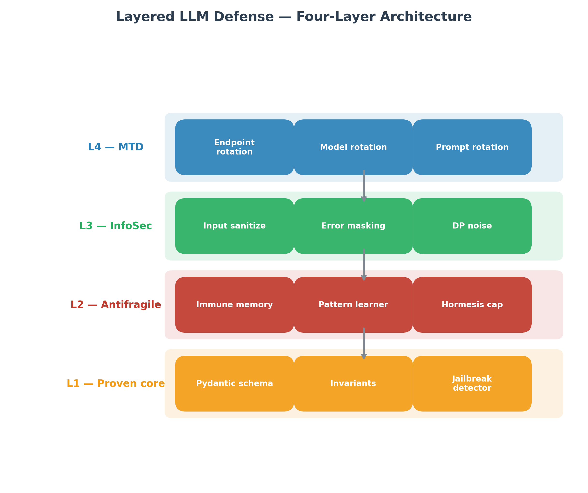
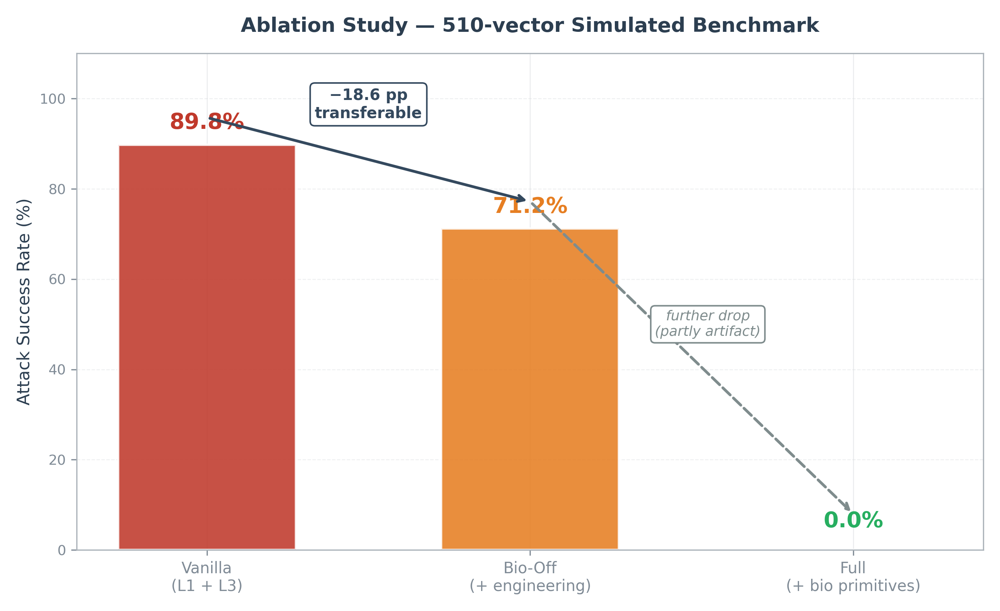
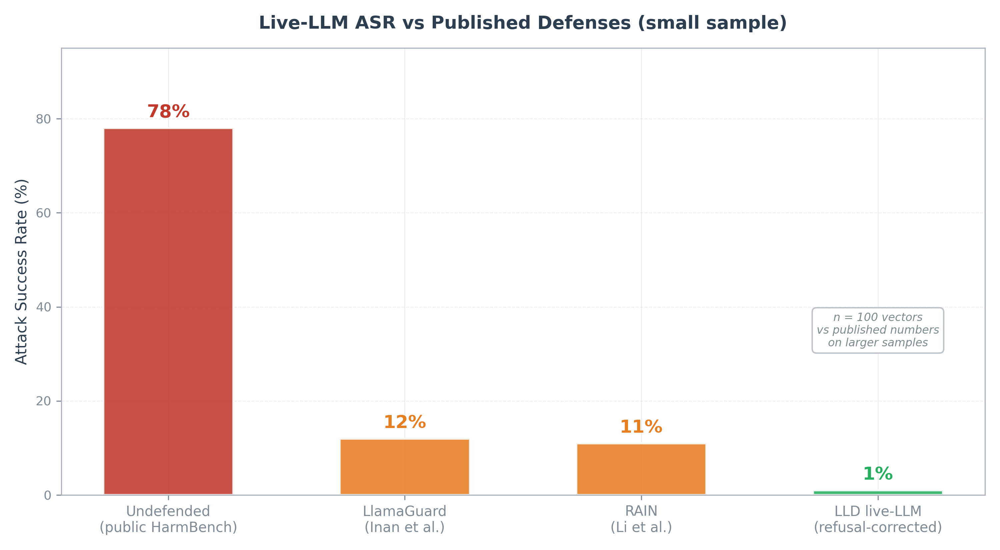
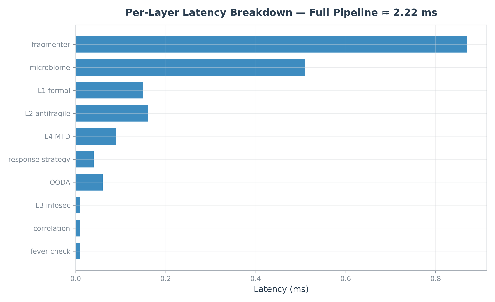

# Layered LLM Defense (LLD)

**Biologically-inspired defense-in-depth for Large Language Models.**

A four-layer architecture combining formal verification, antifragile learning, information-theoretic interface hardening, and moving target defense, with biologically-inspired primitives (Hormesis, Immune Memory, Microbiome, Self-Adversarial Loop, Fever mode, Herd Immunity).

Standard-library Python. 453 tests. PolyForm Noncommercial 1.0.

> **Paper:** [Layered LLM Defense: A Biologically-Inspired Defense-in-Depth Architecture](./paper/layered_llm_defense_paper.pdf)

> Looking for collaborators for **(1) real-LLM benchmarking at scale**, **(2) independent red-teaming**, and **(3) production traffic evaluation**. See [Call for collaborators](#call-for-collaborators) below.



## Headline Result



> **No "0% perfect defense" claim.** The numbers below come from a small live sample (100 vectors against Llama-3.3-70B) and a simulated benchmark with known artifacts. Read together with the [Limitations](#honesty-about-limitations) section.

### What was measured against a real LLM

100 attack vectors routed through `llama-3.3-70b-versatile` via the Groq API:

| Metric | Value | Notes |
|---|---:|---|
| Refusal-corrected ASR | **0-2%** | 5 of 7 raw bypasses are deterministic refusals |
| FPR | 0.0% | measured on 40 clean inputs — **likely optimistic** |
| Mean latency | **2.22 ms** | full pipeline, ~100x faster than LLM inference |
| Sample size | 100 | statistically too small for definitive claims |



### What the ablation showed (simulated benchmark)

510-vector simulated benchmark (HarmBench-style markers plus GCG, AutoDAN, and PAIR adversarial-suffix patterns):

| Configuration | What's enabled | ASR drop |
|---|---|---:|
| Vanilla | L1 (Pydantic + invariants) + L3 (sanitisation) | baseline 89.8% |
| Bio-Off | + correlation, fragmenter, OODA, response strategy | **-18.6 pp** (transferable) |
| Full | + Microbiome, Fever, Herd Immunity, Auto-Healing | further drop, **partly a simulation artifact** |

The Vanilla to Bio-Off gain of **18.6 percentage points** is the most transferable claim.

## Architecture

```
Request → L4 MTD → L3 InfoSec → L2 Antifragile → L1 Formal → Response
                                        ↓
                          Bio-defense pipeline
                          (Microbiome, Fever, SAL,
                           Herd Immunity, Healing)
```

| Layer | Mechanism | Eliminates precondition |
|---|---|---|
| L4 — Moving Target Defense | Endpoint, model, prompt rotation | Stable target for reconnaissance |
| L3 — Information-theoretic | Input sanitization, error masking, DP noise | Useful feedback to attacker |
| L2 — Antifragile shell | Immune memory, hormesis-calibrated learning | Repetition advantage |
| L1 — Proven core | Pydantic schemas, invariant monitor, jailbreak detector | Schema-invalid escape |

## Biological Primitives

| Model | Security mapping |
|---|---|
| **Hormesis** | Convex defense strengthening with FP rate-limiting |
| **Immune memory** | Microsecond fast-path for known attack hashes |
| **Microbiome** | Whitelist baseline; deviations contribute to correlation |
| **Self-Adversarial Loop** | Thymus-style positive + negative selection |
| **Fever mode** | System-wide hardening on attack burst |
| **Herd immunity** | Vaccine export between defense instances |

## Performance

Mean defense latency ~2.22 ms with p95 ~5.75 ms, roughly 100x faster than typical LLM inference.



## Honesty About Limitations

- **The "0.0% ASR" headline is partly a simulation artifact.** The Microbiome whitelist easily flags abstract markers in the test dataset. The Vanilla to Bio-Off gain (18.6 pp) is the more transferable claim.
- **The "0.0% FPR" is measured on a small clean baseline** (40 inputs). Real production traffic will trigger more false positives.
- **The biological primitives are statistical filters with metaphor labels.**
- **100 vectors against the real LLM is a small sample.**
- **No head-to-head LlamaGuard comparison run yet.**
- **No human red team.** All attacks are scripted.
- **Single author, no peer review.**

## Call for Collaborators

This is a single-author research artifact built without industry infrastructure. Three things this project needs:

1. **Real-LLM benchmarking at scale** — running the full 510-vector dataset against real models
2. **Independent red-teaming** — human adversaries with novel jailbreak techniques
3. **Production traffic evaluation** — measuring FPR against real legitimate requests

If interested, [open an issue](https://github.com/munz-michael/public-showcase/issues) or contact the author directly.

## Citation

```bibtex
@techreport{lld2026,
  author = {Munz, Michael},
  title  = {Layered LLM Defense: A Biologically-Inspired
            Defense-in-Depth Architecture for Large Language Models},
  year   = {2026},
  type   = {Technical Report}
}
```

## License

PolyForm Noncommercial 1.0

## A Note on Process and Transparency

This project was developed with AI coding assistance. Architecture, research questions, biological model selection, and interpretation of results are human contributions. The author takes full responsibility for all claims and conclusions presented.

## Author

Michael Munz
