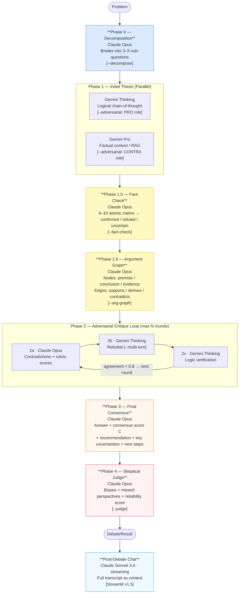
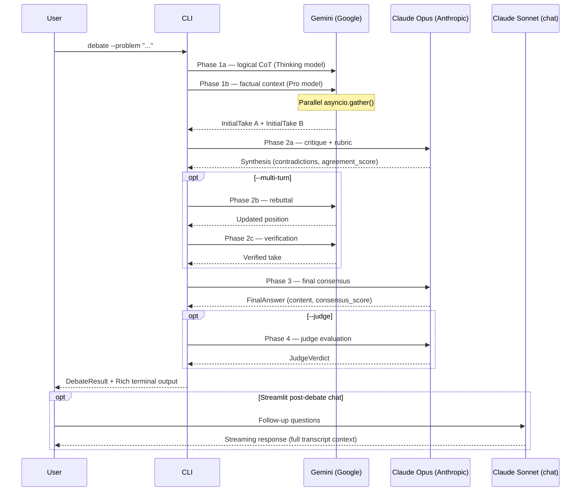
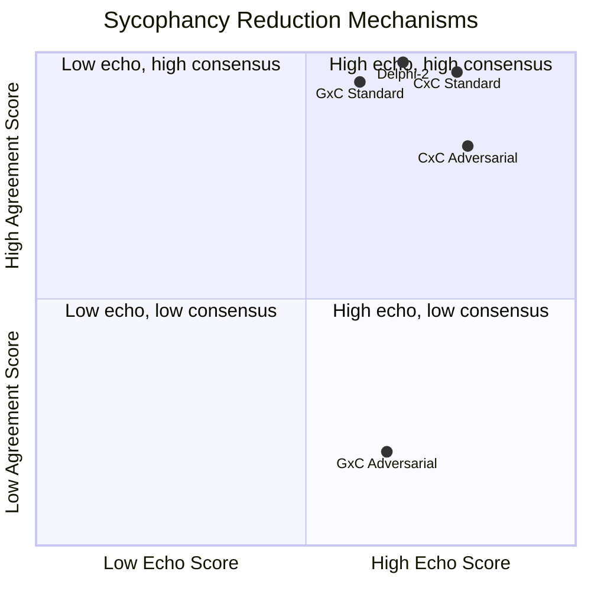
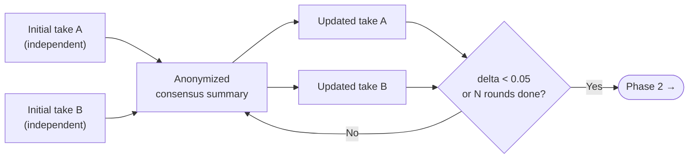

# Architecture — Lean Multi-Provider Debate Framework

## Design Philosophy

The core thesis: **heterogeneous providers reduce sycophancy**.

A single model debating itself will converge on its own biases. By using Gemini (Google) for initial analysis and Claude (Anthropic) for critique and synthesis, we force a genuine adversarial dynamic — each model has different training data, RLHF objectives, and blind spots.

---

## Phase Diagram



---

## Provider Interaction Diagram



---

## Two-Dimensional Sycophancy Model

Empirical finding (E1–E6): sycophancy in LLM debates manifests on **two orthogonal axes**.



| Dimension | Metric | Primary lever | Effect |
|---|---|---|---|
| **Echo chamber** | Echo Score (TF-cosine Phase1→Final) | Cross-provider (GxC) | Δ = −0.175 (−22% relative) |
| **False consensus** | Agreement Score | `--adversarial` role-lock | Δ = −14.7% |

These two axes are **independent**: adversarial mode has no effect on Echo Score (E4: Δ=0.000), and cross-provider has no significant effect on Agreement Score (E1: Δ=−2.0%).

---

## Delphi Mode (alternative Phase 1)

When `--delphi N` is active, Phase 1 is replaced by N rounds of iterative refinement:



**E6 finding**: Delphi *reduces* Echo Score (Δ=−0.070 for 2 rounds) while *increasing* Agreement Score (+2%). Trade-off: use Delphi when echo reduction matters; avoid when agreement inflation is a concern.

---

## Consensus Formula

```
C = Σ(Confidence_i × Agreement_Score) / n
```

Where:
- `Confidence_i` = each agent's stated confidence (0.0–1.0)
- `Agreement_Score` = Claude's self-assessed convergence between analyses (0.0–1.0)
- `n` = number of agents (currently 2)

The score is computed at the end of Phase 2 after critique and verification.

**Thresholds:**
- `C ≥ 0.7` — High convergence
- `0.4 ≤ C < 0.7` — Moderate agreement
- `C < 0.4` — Significant divergence (treat answer with caution)

---

## Convergence Mechanism

Phase 2 runs for `max_rounds` but exits early if `agreement_score ≥ 0.8` after any round. This prevents unnecessary API costs when models already agree after the first critique.

---

## Mode Presets

Three presets map to flag combinations:

| Mode | Flags active | Est. cost | Est. time |
|---|---|---|---|
| `quick` | (none) | ~$0.04 | ~30s |
| `standard` | `--fact-check --judge` | ~$0.08 | ~60s |
| `deep` | `--fact-check --judge --decompose --arg-graph --multi-turn --calibrate --rounds 2` | ~$0.18 | ~120s |

Presets are available in both CLI (`--mode`) and Streamlit sidebar.

---

## Context Injection

User-supplied context (`--context` CLI / sidebar textarea + file upload) is injected at Phase 1:

```python
sub_q = f"\n\n--- Context provided by user ---\n{context_text}\n---\n" + sub_q
```

This ensures both Gemini models and all Claude calls operate on the same grounding facts. Supported upload formats: PDF (text extracted via pypdf), Markdown, plain text.

---

## Post-Debate Chat Layer (v1.5)

After a debate completes, the full transcript is serialized into a system prompt (~3000–5000 tokens) and passed to Claude Sonnet 4.6 for streaming chat. The chat layer supports:

- Free-form follow-up questions
- Quick-action prompts (Executive Summary, Steelman, Decision Memo, etc.)
- Multi-turn conversation with full history
- No additional debate API calls — reuses already-paid transcript

Model choice: Sonnet 4.6 (vs Opus for debate) — sufficient for synthesis/reframing tasks, significantly cheaper for interactive use.

---

## Package Structure

```
lean_multi_agent_debate/
├── debate/                  # Python package (pip install -e .)
│   ├── __init__.py          # Version + public API
│   ├── __main__.py          # python -m debate entry point
│   ├── cli.py               # argparse CLI + stats/list/resolve subcommands
│   ├── debate_manager.py    # Phase orchestration + all API calls
│   ├── models.py            # Pydantic v2 data models
│   ├── output_formatter.py  # Rich terminal output + Markdown reports
│   ├── config.py            # Pydantic Settings (API keys, model IDs)
│   └── utils/
│       └── logger.py        # Rich logger with cost tracking
├── tests/                   # pytest test suite (61 tests, no API keys)
│   ├── conftest.py          # Mock Claude + Mock Gemini fixtures
│   ├── test_models.py       # Pydantic validation + computed properties
│   ├── test_debate_manager.py  # Phase logic with mocked APIs
│   ├── test_output_formatter.py  # Rendering smoke tests
│   └── test_cli.py          # CLI entry points, presets, subcommands
├── benchmarks/              # Evaluation suite
│   ├── datasets.py          # 15 test problems (factual/controversial/technical)
│   ├── metrics.py           # DebateMetrics + BenchmarkReport
│   ├── runner.py            # CLI runner with --mock flag
│   └── sycophancy_compare.py  # Cross-provider sycophancy benchmark (E1–E6)
├── paper/                   # Research paper (LaTeX)
│   └── debate_paper.tex
├── mcp_server/              # MCP Server (Claude Code integration)
│   ├── server.js            # 4 MCP tools: debate_run, calibration_stats,
│   │                        #   list_reports, debate_compare
│   └── package.json
├── streamlit_app.py         # Streamlit Web UI (v1.5)
├── pyproject.toml           # Package metadata + entry points
└── output/                  # Reports + calibration_history.jsonl
```

---

## Why Gemini × Claude?

| Dimension | Gemini Thinking | Claude Opus |
|---|---|---|
| Training data | Google-curated, Search-grounded | Anthropic Constitutional AI |
| Reasoning style | Long CoT, exploratory | Structured, safety-oriented |
| Grounding | Native Google Search integration | No built-in web access |
| Sycophancy risk | Low (different RLHF) | Low (different RLHF) |

Running two models from the same provider (e.g., GPT-4o vs GPT-4o-mini) risks correlated biases. Cross-provider debate surfaces genuine disagreements. **Empirical confirmation**: E1 shows GxC Echo Score = 0.601 vs. CxC = 0.776 (Δ = −0.175).

---

## Calibration Tracking

When `--calibrate` is active, Claude Opus extracts probabilistic claims from both analyses:

```json
{
  "claim": "There is a 30% chance of Y in 5 years.",
  "probability": 0.30,
  "ci_lower": 0.15,
  "ci_upper": 0.50,
  "model_id": "claude-opus-4-6",
  "time_horizon": "5 years",
  "outcome": null,
  "outcome_note": ""
}
```

Claims are persisted to `output/calibration_history.jsonl`. Outcomes can be recorded retroactively:

```bash
debate resolve debate-abc123 0 true --note "Confirmed by 2026 NIST report"
```

---

## MoA (Mixture of Agents)

In MoA mode (`--moa`), each role (logical analysis + factual context) is filled by **both** Gemini Thinking and Gemini Pro in parallel. Claude Opus then aggregates the two responses into a single `InitialTake` with `aggregated_from` populated.

This reduces individual model variance at the cost of 2× Gemini API calls in Phase 1.
